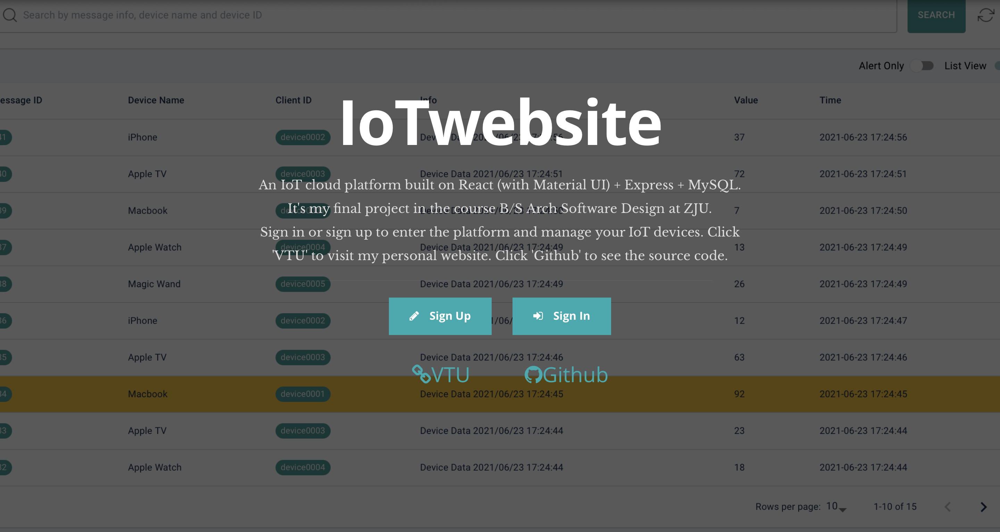
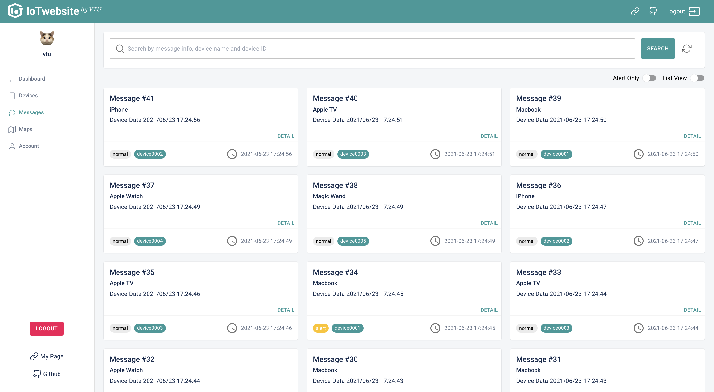

# README


This repository contains my final project for course *B/S Arch Software Design*. The project is an IoT platform website, consisting of a **MQTT server** receiving info from (simulated) devices, a **MySQL server** storing data, an **Express Node.js** backend, a **React** with **Material UI** frontend (using the template [material-kit-react](https://github.com/devias-io/material-kit-react)).

## Demo

Pages' screen shots look like these:







---

## Quick Setup

### Frontend & Backend

First install dependency with:
```bash
# Under the root directory of the repository
npm i # if failed, use `npm i --force` instead
cd server && npm i && cd ..
```

Start both the frontend and the backend concurrently (in development mode) with:
```bash
# Under the root directory of the repository
npm run whole
```

By default, the frontend runs at localhost:3000, and the backend runs at localhost:3001.

You can customize the **backend port (default 3001)** by altering

1. First,  `src/utils/config.json`:

```json
{
    "backend_host": "http://localhost:3001" # replace the 3001 with any port you like
}
```

2. Then `server/bin/www` at lines:

```js
/**
 * Get port from environment and store in Express.
 */

var port = normalizePort(process.env.PORT || '3001'); # here! replace 3001 with any port you like
app.set('port', port);
```

You can customize the **frontend port (default 3000)** by altering `node_modules/react-scripts/scripts/start.js` at lines:

```js
// Tools like Cloud9 rely on this.
const DEFAULT_PORT = parseInt(process.env.PORT, 10) || 3000;
const HOST = process.env.HOST || '0.0.0.0';
```

(This is not recommended, it's troublesome during migration.)

Now with `npm run whole`, you should see the home page now :). But it's not done yet! You should also set up the MySQL database, the [EMQX Enterprise](https://www.emqx.cn/products/enterprise) MQTT server, and the simulated IoT client devices for the whole website to work.

### MySQL Server (8.0+)

You can set up your MySQL server anywhere you like, even not at localhost.

Initialize the **mqtt** database in MySQL with the following command:

```mysql
create databse mqtt;
use mqtt;

DROP TABLE IF EXISTS `mqtt_client`;
CREATE TABLE `mqtt_client` (
    `id` int(11) unsigned NOT NULL AUTO_INCREMENT,
    `clientid` varchar(64) DEFAULT NULL,
    `state` varchar(3) DEFAULT NULL,
    `node` varchar(64) DEFAULT NULL,
    `online_at` datetime DEFAULT NULL,
    `offline_at` datetime DEFAULT NULL,
    `created` timestamp NULL DEFAULT CURRENT_TIMESTAMP,
    PRIMARY KEY (`id`),
    KEY `mqtt_client_idx` (`clientid`),
    UNIQUE KEY `mqtt_client_key` (`clientid`),
    INDEX topic_index(`id`, `clientid`)
) ENGINE=InnoDB DEFAULT CHARSET=utf8MB4;

create table account(
	user_name varchar(30) primary key,
	password_hash varchar(64),
	email varchar(64) unique,
	phone_number varchar(64));

create table device_info(
	clientid varchar(64),
	device_name varchar(64),
	user_name varchar(64),
	primary key (clientid, user_name),
	foreign key (clientid) references mqtt_client(clientid),
    foreign key (user_name) references account(user_name));

create table message(
    msgid int unsigned primary key auto_increment,
    alert bit,
    clientid varchar(64),
    info varchar(256),
    lat numeric(20, 14),
    lng numeric(20, 14),
    timestamp timestamp,
    value int,
	foreign key (clientid) references mqtt_client(clientid)
);

CREATE TABLE `mqtt_sub` (
    `id` int(11) unsigned NOT NULL AUTO_INCREMENT,
    `clientid` varchar(64) DEFAULT NULL,
    `topic` varchar(180) DEFAULT NULL,
    `qos` tinyint(1) DEFAULT NULL,
    `created` timestamp NULL DEFAULT CURRENT_TIMESTAMP,
    PRIMARY KEY (`id`),
    KEY `mqtt_sub_idx` (`clientid`,`topic`,`qos`),
    UNIQUE KEY `mqtt_sub_key` (`clientid`,`topic`),
    INDEX topic_index(`id`, `topic`)
) ENGINE=InnoDB DEFAULT CHARSET=utf8MB4;

CREATE TABLE `mqtt_msg` (
    `id` int(11) unsigned NOT NULL AUTO_INCREMENT,
    `msgid` varchar(64) DEFAULT NULL,
    `topic` varchar(180) NOT NULL,
    `sender` varchar(64) DEFAULT NULL,
    `node` varchar(64) DEFAULT NULL,
    `qos` tinyint(1) NOT NULL DEFAULT '0',
    `retain` tinyint(1) DEFAULT NULL,
    `payload` blob,
    `arrived` datetime NOT NULL,
    PRIMARY KEY (`id`),
    INDEX topic_index(`id`, `topic`)
) ENGINE=InnoDB DEFAULT CHARSET=utf8MB4;

CREATE TABLE `mqtt_retain` (
    `id` int(11) unsigned NOT NULL AUTO_INCREMENT,
    `topic` varchar(180) DEFAULT NULL,
    `msgid` varchar(64) DEFAULT NULL,
    `sender` varchar(64) DEFAULT NULL,
    `node` varchar(64) DEFAULT NULL,
    `qos` tinyint(1) DEFAULT NULL,
    `payload` blob,
    `arrived` timestamp NOT NULL DEFAULT CURRENT_TIMESTAMP,
    PRIMARY KEY (`id`),
    UNIQUE KEY `mqtt_retain_key` (`topic`),
    INDEX topic_index(`id`, `topic`)
) ENGINE=InnoDB DEFAULT CHARSET=utf8MB4;

DROP TABLE IF EXISTS `mqtt_acked`;
CREATE TABLE `mqtt_acked` (
    `id` int(11) unsigned NOT NULL AUTO_INCREMENT,
    `clientid` varchar(64) DEFAULT NULL,
    `topic` varchar(180) DEFAULT NULL,
    `mid` int(11) unsigned DEFAULT NULL,
    `created` timestamp NULL DEFAULT NULL,
    PRIMARY KEY (`id`),
    UNIQUE KEY `mqtt_acked_key` (`clientid`,`topic`),
    INDEX topic_index(`id`, `topic`)
) ENGINE=InnoDB DEFAULT CHARSET=utf8MB4;
```

> Actually, only the first 4 tables (`mqtt_client`, `account`, `device_info`, `message`) are used. But you need to create all of them for the EMQX Enterprise server to correctly activate its mysql plugin!

Then set up your MySQL account info at `server/utils/mysql_config.json` (create it if not exist!):

```json
{
    "host"     : "YOUR MYSQL HOST",
    "user"     : "YOUR USER NAME",
    "password" : "PASSWORD",
    "database" : "mqtt",
    "port"     : YOUR MYSQL PORT
}
```

### EMQX Enterprise Server

Follow the [EMQX official guide](https://docs.emqx.cn/enterprise/v4.3/#开始使用) to set up your EMQX **Enterprise** server. I recommend you to install EMQX Enterprise via its zip file [here](https://www.emqx.cn/downloads#enterprise), not package management tools like `apt`. After activating it with a free trial license, you can start the EMQX server via

```bash
[PATH TO EMQX ENTERPRISE]/bin/emqx start
```

Most importantly, remember to enable the `emqx_backend_mysql` plugin to let the MQTT server store device info into the `mqtt` database (check [here](https://docs.emqx.cn/enterprise/v4.3/backend/backend_mysql.html) to see the full steps and detail). For me, I set up the MySQL server account info at `[PATH TO EMQX ENTERPRISE]/etc/plugins/emqx_backend_mysql.conf`. I suggest you directly use my `emqx_backend_mysql.conf`:

```conf
##====================================================================
## Configuration for EMQ X MySQL Backend
##====================================================================

## MySQL Server
backend.mysql.pool1.server = localhost # or any other host

## MySQL Pool Size
backend.mysql.pool1.pool_size = 8
## MySQL Username
backend.mysql.pool1.user = [USERNAME]
## MySQL Password
backend.mysql.pool1.password = [PASSWORD]
## MySQL Database
backend.mysql.pool1.database = mqtt # don't change the database's name

## Client Connected Record 
backend.mysql.hook.client.connected.1    = {"action": {"function": "on_client_connected"}, "pool": "pool1"}

## Session Created Record 
backend.mysql.hook.client.connected.2     = {"action": {"function": "on_subscribe_lookup"}, "pool": "pool1"}

## Client DisConnected Record 
backend.mysql.hook.client.disconnected.1 = {"action": {"function": "on_client_disconnected"}, "pool": "pool1"}
```

Then, enable **emqx_backend_mysql** with:

```bash
[PATH TO EMQX ENTERPRISE]/bin/emqx_ctl plugins load emqx_backend_mysql
```

If you set up successfully, you should see this line popping up:

```bash
Plugin emqx_backend_mysql loaded successfully.
```

If you have set up the MySQL account, **mqtt** database (in the last chapter) and several necessary tables previously, it should be working! Your IoT device status would be automatically stored into **mqtt** database while connecting to the EMQX server.

Now, switch back to the root of **this directory**. Set up your MQTT config at `server/utils/mqtt_config.json` (create it if not exist!):

```json
{
    "host": "YOUR MQTT HOST", # e.g. mqtt://localhost
  	"topic": "YOUR MQTT TOPIC" # by default 'testapp', change if your iotclients use another topic
}
```

Now run `npm run whole` again, the IoT platform should be fully activated. If anything go wrong, check the backend terminal or frontend console for debug info.

### IoT Client

Still, you have no devices. Now we manually simulate some. The IoT client devices are simulated by code, lying under `./iotclient`, which are provided by my teacher, [Hu Xiaojun](https://person.zju.edu.cn/huxiaojun#0). Follow the README of it to create some "devices":

1. Compile the code with
```bash
mvn clean package
```

2. Run
- Put `iot.properties` at the same directory of `iotclient-1.0.0.jar`.
- Alter `iot.properties` to configure device number, mqtt topic (by default **testapp**) and related info.
- Run with
```bash
java -jar iotclient-1.0.0.jar
```
- The simulated clients will automatically subscribe to the specified MQTT server, and keep sending some randomized messages.

## Release Version

It's quite necessary to compile the frontend into a **production build** (release) version through `npm run build`, which would be much lighter for deployment. But before compilation, you may need to alter the configure file `src/utils/config.json`:

```json
{
    "backend_host": "http://localhost:3001"
}
```

The `backend_host` is where you deploy the backend `./server/` though `node (server/)bin/www`. For example, the below config means that you're have deployed the backend at `123.123.123.123:8000`. (The default backend is at port 3001, you can alter `server/bin/www` to change it like any other Express app!)

```json
{
    "backend_host": "http://123.123.123.123:8000"
}
```

> Remember to keep the `http` tag!

Then, generate release version frontend through:

```bash
npm run build
```

The generated static files should be at `./build/`. Now, feel free to deploy the static frontend via servers like Nginx, etc. When you are using those other servers, remember to redirect any error uri to `build/index.html`, and the frontend router would automatically re-render the single page frontend :).

